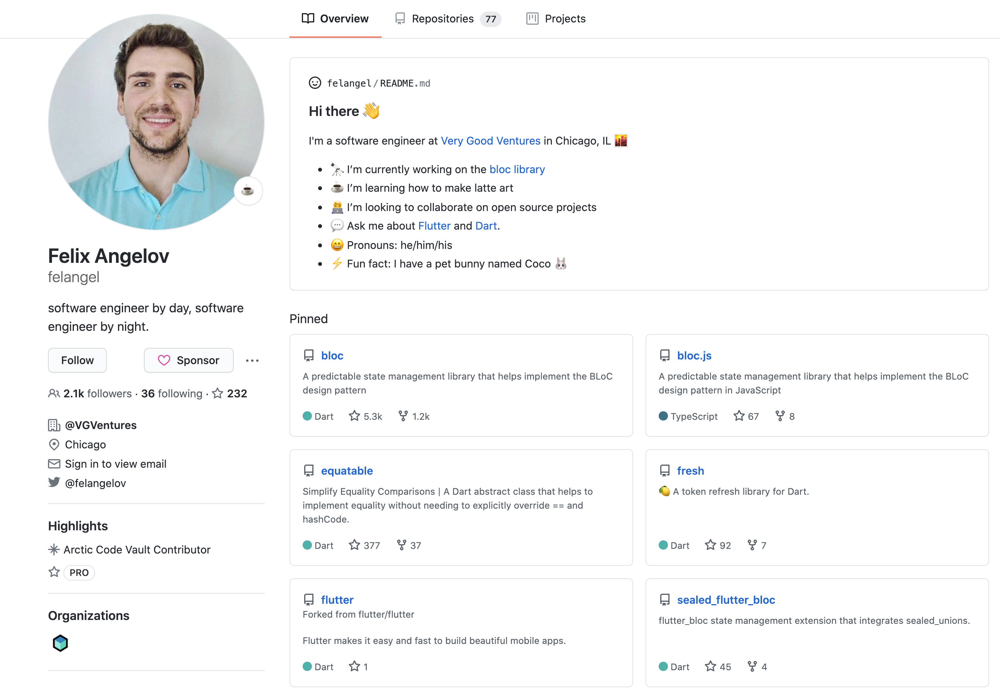
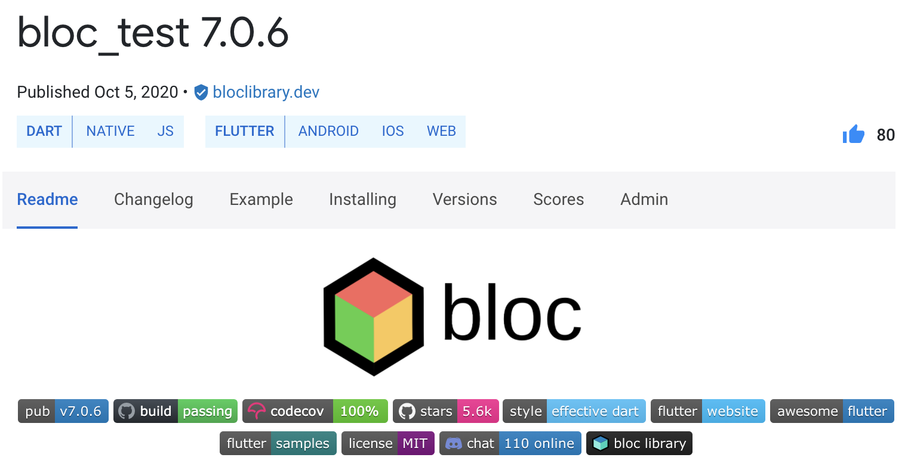
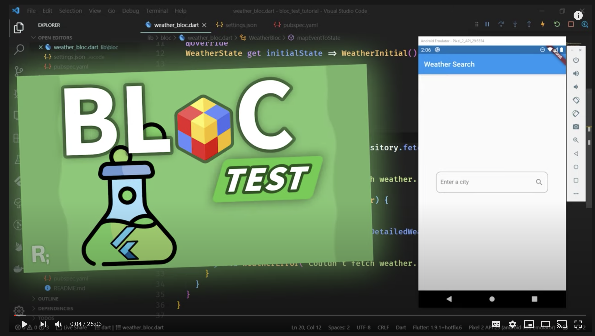
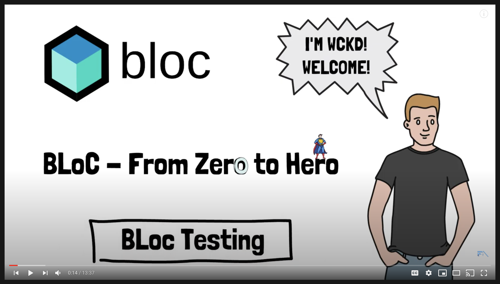
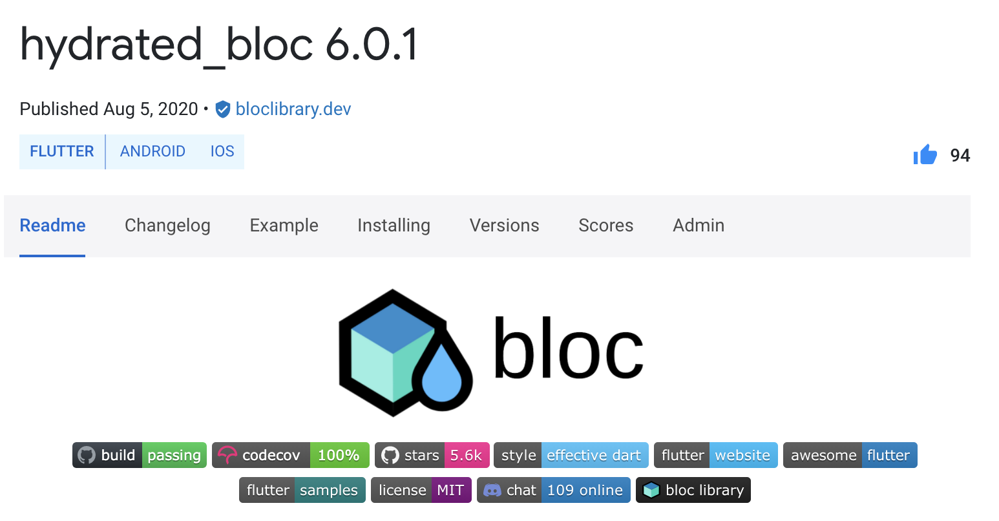
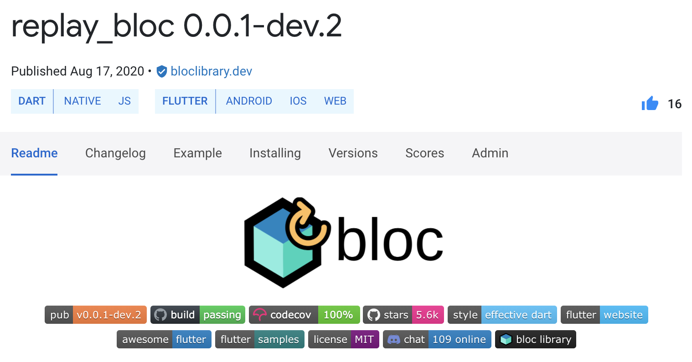

footer: @felangelov - Flutter Warsaw Meetup 2020
slidenumbers: true

# Cubit: Advanced Topics 🚀

### Felix Angelov @ Very Good Ventures

---

# Very Good Ventures, Chicago 🕶️🦄



### [https://verygood.ventures](https://verygood.ventures)

---

# Agenda

- 🧪 Testing with BlocTest
- 🚰 Caching with HydratedBloc
- ⏳ Undo/Redo with ReplayBloc

---

# Testing with BlocTest



---

# Testing Goals 🧪

```dart
blocTest(
  'emits correct weather',
  build: () => WeatherCubit(),
  act: (cubit) => cubit.fetchWeather(city: 'Warsaw'),
  expect: [
    WeatherState.loading(),
    WeatherState.success(
      Weather(
        temperature: 10.3,
        condition: WeatherCondition.cloudy,
      ),
    ),
  ],
)
```

---

# Questions ❓

- How can we control the emitted state?
- How can the test be consistent?
- How can we test error cases?

---

# Answers 💡

- How can we control the emitted state?
  - Decouple the cubit from the repository
- How can the test be consistent?
  - Inject a mock repository
- How can we test error cases?
  - Stub an exception

---

# WeatherCubit

```dart
class WeatherCubit extends Cubit<WeatherState> {
  ...

  Future<void> fetchWeather({@required String city}) async {
    emit(WeatherState.loading());
    try {
      final weather = await _weatherRepository.getWeather(city);
      emit(WeatherState.success(weather));
    } on Exception {
      emit(WeatherState.failure());
    }
  }
}
```

---

# Handling Dependencies: The Easy Way

```dart
class WeatherCubit extends Cubit<WeatherState> {
  WeatherCubit() : super(WeatherState.initial());

  final WeatherRepository _weatherRepository = WeatherRepository();
}
```

---

# Handling Dependencies: The Better Way

```dart
class WeatherCubit extends Cubit<WeatherState> {
  WeatherCubit(this._weatherRepository) : super(WeatherState.initial());

  final WeatherRepository _weatherRepository;
}
```

---

# Let's take it from the top (of the widget tree)

```dart
void main() {
  final weatherRepository = WeatherRepository();
  runApp(
    WeatherApp(
      weatherRepository: weatherRepository,
    ),
  );
}
```

---

# Providing the Repository

```dart
class WeatherApp extends StatelessWidget {
  WeatherApp({Key key, @required this.weatherRepository})
    : super(key: key);

  final WeatherRepository weatherRepository;

  @override
  Widget build(BuildContext context) {
    return RepositoryProvider.value(
      value: weatherRepository,
      child: MaterialApp(...),
    );
  }
}
```

---

# What if there are many?

```dart
class WeatherApp extends StatelessWidget {
  ...

  @override
  Widget build(BuildContext context) {
    return MultiRepositoryProvider(
      providers: [
        RepositoryProvider.value(value: weatherRepository),
        RepositoryProvider.value(value: userRepository),
        ...
      ],
      child: MaterialApp(...),
    );
  }
}
```

---

# Providing the Cubit

```dart
class HomePage extends StatelessWidget {
  @override
  Widget build(BuildContext context) {
    return BlocProvider(
      create: (context) => WeatherCubit(
        context.repository<WeatherRepository>(),
      ),
      child: HomeView(),
    );
  }
}
```

---

# Consuming the Cubit

```dart
class HomeView extends StatelessWidget {
  @override
  Widget build(BuildContext context) {
    return BlocBuilder<WeatherCubit, WeatherState>(
      builder: (context, state) {
        switch (state.status) {
          case WeatherStatus.initial:
            return WeatherEmpty();
          case WeatherStatus.loading:
            return WeatherLoading();
          case WeatherStatus.success:
            return WeatherPopulated(weather: state.weather);
          case: WeatherStatus.failure:
          default:
            return WeatherError();
        }
      },
    );
  }
}
```

---

# Setting Up & Tearing Down

```dart
class MockWeatherRepository extends Mock implements WeatherRepository {}

group('WeatherCubit', () {
  WeatherRepository weatherRepository;
  WeatherCubit weatherCubit;

  setUp(() {
    weatherRepository = MockWeatherRepository();
    weatherCubit = WeatherCubit(weatherRepository);
  });

  tearDown(() {
    weatherCubit.close();
  });
});
```

---

# Stubbing the Repo

```dart
const warsawWeather = Weather(
  temperature: 10.3,
  condition: WeatherCondition.cloudy,
);

blocTest(
  'emits weather when repository returns successfully',
  build: () {
    when(weatherRepository.getWeather(any))
      .thenAnswer((_) async => warsawWeather);
    return weatherCubit;
  },
  act: ...,
  expect: ...
);
```

---

# Expectations

```dart
blocTest(
  'emits weather when repository returns successfully',
  build: ...
  act: (cubit) => cubit.fetchWeather(city: 'Warsaw'),
  expect: [
    WeatherState.loading(),
    WeatherState.success(warsawWeather),
  ],
);
```

---

# Verification ✅

```dart
blocTest(
  'invokes getWeather with correct city name',
  build: ...
  act: (cubit) => cubit.fetchWeather(city: 'Warsaw'),
  verify: (_) {
    verify(weatherRepository.getWeather('Warsaw')).called(1);
  },
);
```

---

# Rainy Day 🌧️

```dart
const weatherException = Exception('weather-exception');

blocTest(
  'emits failure when repository throws',
  build: () {
    when(weatherRepository.getWeather(any)).thenThrow(weatherException);
    return weatherCubit;
  },
  act: (cubit) => cubit.fetchWeather(city: 'Warsaw'),
  expect: [
    WeatherState.loading(),
    WeatherState.failure(),
  ]
);
```

---

# What about the Widgets? 🤔

---

# Setting Up

```dart
class MockWeatherCubit extends MockBloc<WeatherState> implements WeatherCubit {}

group('HomeView', () {
  WeatherCubit weatherCubit;

  setUp(() {
    weatherCubit = MockWeatherCubit();
  });
});
```

---

# Stubbing & Expecting the Initial State

```dart
testWidgets('renders WeatherEmpty when state is initial', (tester) async {
  when(weatherCubit.state).thenReturn(WeatherState.initial());
  await tester.pumpWidget(
    BlocProvider.value(
      value: weatherCubit,
      child: HomeView(),
    ),
  );
  expect(find.byType(WeatherEmpty), findsOneWidget);
});
```

---

# What about the Loading State? 🔄

```dart
testWidgets('renders WeatherLoading when state is loading', (tester) async {
  when(weatherCubit.state).thenReturn(WeatherState.loading());
  await tester.pumpWidget(
    BlocProvider.value(
      value: weatherCubit,
      child: HomeView(),
    ),
  );
  expect(find.byType(WeatherLoading), findsOneWidget);
});
```

---

# What about the Success State? ☀️

```dart
const warsawWeather = Weather(
  temperature: 20.1,
  condition: WeatherCondition.sunny,
);

testWidgets('renders WeatherPopulated when state is success', (tester) async {
  when(weatherCubit.state).thenReturn(WeatherState.success(warsawWeather));
  await tester.pumpWidget(
    BlocProvider.value(
      value: weatherCubit,
      child: HomeView(),
    ),
  );
  expect(find.byType(WeatherPopulated), findsOneWidget);
});
```

---

# What about the Failure State? 😱

```dart
testWidgets('renders WeatherError when state is failure', (tester) async {
  when(weatherCubit.state).thenReturn(WeatherState.failure());
  await tester.pumpWidget(
    BlocProvider.value(
      value: weatherCubit,
      child: HomeView(),
    ),
  );
  expect(find.byType(WeatherError), findsOneWidget);
});
```

---

# Cubit Interactions

```dart
class SearchView extends StatelessWidget {
  @override
  Widget build(BuildContext context) {
    return Scaffold(
      ...
      floatingActionButton: FloatingActionButton(
        child: Icon(Icons.search),
        onPressed: () {
          context.bloc<WeatherCubit>().fetchWeather('Warsaw');
        }
      )
    );
  }
}
```

---

# Verifying Interactions

```dart
testWidgets('calls fetchWeather when search is pressed', (tester) async {
  when(weatherCubit.state).thenReturn(WeatherState.initial());
  await tester.pumpWidget(
    BlocProvider.value(
      value: weatherCubit,
      child: SearchView(),
    ),
  );
  await tester.tap(find.byType(FloatingActionButton));
  verify(weatherCubit.fetchWeather(city: 'Warsaw')).called(1);
});
```

---

# Side-Effects

```dart
class DetailsView extends StatelessWidget {
  @override
  Widget build(BuildContext context) {
    return BlocListener<WeatherCubit, WeatherState>(
      listener: (context, state) {
        if (state.status == WeatherStatus.failure) {
          Scaffold.of(context)
           ..hideCurrentSnackBar()
           ..showSnackBar(SnackBar(...));
        }
      },
      child: ...
    )
  }
}
```

---

# Testing Side-Effects (Listen Carefully 👂)

```dart
testWidgets('shows SnackBar when state is failure', (tester) async {
  whenListen(weatherCubit, Stream.fromIterable([
    WeatherState.initial(),
    WeatherState.failure(),
  ]));
  await tester.pumpWidget(
    BlocProvider.value(
      value: weatherCubit,
      child: DetailsView(),
    ),
  );
  await tester.pump();
  expect(find.byType(SnackBar), findsOneWidget);
});
```

---

# More Testing Resources

[.column]

https://youtu.be/S6jFBiiP0Mc

[.column]

https://youtu.be/cVru6Gy4duQ

---

# Caching with HydratedBloc



---

# How to Hydrate? 🚰

[.column]

```dart
class CounterCubit extends Cubit<int> {
  CounterCubit() : super(0);

  void increment() => emit(state + 1);
}
```

[.column]

```dart
class CounterCubit extends HydratedCubit<int> {
  CounterCubit() : super(0);

  void increment() => emit(state + 1);

  @override
  int fromJson(Map<String, dynamic> json) {
    return json['counter'] as int;
  }

  @override
  Map<String, dynamic> toJson(int state) {
    return {'counter': state};
  }
}
```

---

# Undo/Redo with ReplayBloc



---

# How to Replay? ⏳

[.column]

```dart
class CounterCubit extends Cubit<int> {
  CounterCubit() : super(0);

  void increment() => emit(state + 1);
}
```

[.column]

```dart
class CounterCubit extends ReplayCubit<int> {
  CounterCubit() : super(0);

  void increment() => emit(state + 1);
}
```

---

# 👩‍💻👨‍💻

# Demo Time

## https://github.com/felangel/cool_counter

---


# Additional Resources

## https://bloclibrary.dev

## https://discord.gg/Hc5KD3g

---

# 🙏 💙

# Thank You!
